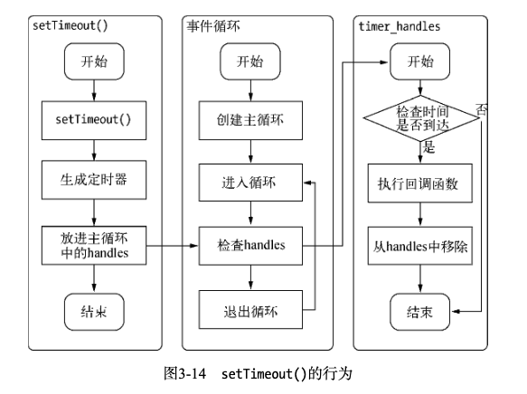

# 第三章 异步`I/O`

本章学习异步I/O的介绍，书中整篇内容较为枯燥，我在这里按照自己的理解结合书中的内容，在此总结以下。
$$
前言：

- 前端开发应该很熟悉异步编程的概念。
- 异步其实很早就在操作系统的底层开始使用了，但是在很多高级编程语言中，几乎对异步避而不提，比如PHP。
- 将异步作为主要编程方式和设计理念的，Node是首个。
- Node具备面向客户端管理链接的强大能力，即可以作为服务端去处理客户端带来的大量并发请求，也能作为客户端向网络中的各个应用进行并发请求。

## 3.1为什么要异步`I/O`

从两个角度出发：

- 用户体验
- 资源分配

### 用户体验

这个还得结合浏览器与javascript，JavaScript是单线程的，与浏览器UI渲染公用一个线程。

导致JavaScript执行的时候UI渲染和响应是处于停滞状态的。

如果页面不能及时进行渲染，会给用户带来网络卡顿的体验。影响用户交互。

想象以下，页面有两个请求request1、request2。

如果JavaScript采用同步的方式，意味着，只有当request1请求结束之后，才能进行request2。

这时请求总耗时 time = request1 + request2

如果以异步的方式进行，request2的执行不受request1请求的影响，调用request1之后，可以紧接着执行request2，总耗时 time = Math.min(request1, request2)。

由此可见异步带来的效益是非常大的。

### 资源分配

什么是资源？

资源在这里可以理解为计算机的CPU、内存空间...。

假设业务场景中有一组互不相干的任务需要完成，现行的主流方法有两种：

- 单线程串行依次完成
- 多线程并行完成

单线程：

- 串行执行会造成阻塞问题，每一个任务只能等上一个任务执行结束之后才能开始。
- 不能高效利用计算机资源
- 符合开发人员按顺序思考的方式

多线程：

- 创建线程和执行线程上下文切换的开销较大。
- 在复杂的ˉ务中，多线程编程经常面临锁、状态同步等问题 

多线程优势：

在多核CPU上可以提高CPU利用率。


## 3.2 异步`I/O`实现现状

### 3.2.1 异步I/O与非阻塞I/O

每当提起Node的时候，都会提起它是非阻塞I/O。

从字面依次我的理解：同步I/O导致阻塞I/O、异步I/O实现非阻塞I/O。

在计算机内核I/O，异步/同步与阻塞/非阻塞是两回事。

操作系统内核对于I/O只有两种方式：阻塞和非阻塞。

调用阻塞I/O时，应用程序需要等待I/O完成才能返回结果。


阻塞造成的问题：等待I/O，浪费等待时间，CPU的处理能力得不到充分利用。

调用非阻塞I/O，CPU的时间片可以用来处理其他事务，可以提升性能。

但非阻塞I/O是立即返回数据，并不能保证数据返回的完整性。

为了获取完整的数据，应用程序需要重复调用I/O操作确认是否完成，这种重复的操作叫做**轮询**。

轮询操作会造成CPU处理状态判断，同样会对CPU资源造成浪费。


后面介绍了几种轮询的方式read、select、poll、epoll、kqueue。

### 3.2.2理想额的非阻塞异步I/O


理想情况下，能否有一种异步I/O，由应用层发起异步I/O到系统内核，然后应用层不需等待I/O操作结束，而是通过一种信号或者回调的方式，当CPU处理数据结束之后，通过信号或者回调时间传给应用层，重而完成任务。

答案是有，但是只限于Linux系统，而且还是有缺陷的。

### 3.2.3 现实的异步I/O


现实情况是通过开启多线程+轮询的方式解决的。在利用线程之间的通信方法解决数据传递的问题。

## 3.3 `Node`的异步`I/O`

完成一个完整的异步I/O环境需要经过：事件循环、观察者、请求对象。

### 3.3.1 事件循环


### 3.3.2 观察者

通过观察者判断是否还有时间待处理。

每个事件循环中有一个或者多个观察者，判断是否由事件需要处理的过程就是向这些观察者循环是否又要处理的事件。

### 3.3.3 请求对象


从JavaScript发起调用到内核执行完I/O操作的过度过程中，会创建一个中间产物：请求对象。

中间的所有状态都会保存在请求对象中，包括送入线程池等待执行以及I/O操作完毕后的回调处理。

### 3.3.4执行回调

## 3.4 非`I/O`的异步`API`

Node与I/O无关的异步API：setTimeout()、setInterval()、setImmediate()、process.nextTick()。

### 3.4.1 定时器

调用setTimeout()、setInterval()创建时的定时器会被插入到定时器观察者内部的一个红黑树中。

每次Tick执行时，会从该红黑树中迭代取出定时器对象，检查是否操作定时时间。

如果超过就形成一个时间，立即执行回调函数。



### 3.4.2 process.nextTick()

每次调用process.nextTick()方法，只会将回调函数放入队列中，在下一轮Tick时取出执行，定时器中采用红黑树的操作时间复杂度为O(lg(n))，nextTick的时间复杂度为O(1)，相较之下pricess.nextTick()更为高效。

### 3.4.3 setImmediate()

- 

```js
process.nextTick(function () {   console.log('延迟执行'); }); 
console.log('正常执行');
```


```js
setImmediate(function () {   console.log('延迟执行'); }); 
console.log('正常执行'); 
```


```js
process.nextTick(function () {   console.log('nextTick延迟执行'); }); 
setImmediate(function () {   console.log('setImmediate延迟执行'); }); 
console.log('正常执行');

// 正常执行
// nextTick延迟执行
// setImmedidate延迟执行
```

从输出可以知道process.nextTick的优先级是高于setImmediate的。

这是应为事件循环对观察者的检查是由先后顺序的。process.nextTick属于Idle观察者，setImmediate属于check观察者。在每一个循环检查中，前者优先于后者。


```js
process.nextTick(function() {
  console.log("nextTick1")
})

process.nextTick(function() {
  console.log("nextTick2")
})

setImmediate(function() {
  console.log("setImmediate")
  process.nextTick(function() {
    console.log("插入")
  })
})

setImmediate(function () {  
  console.log('setImmediate2'); 
});
console.log('正常执行');
```


## 3.5 事件驱动与高性能服务器


- 同步式。一次只能处理一个请求，并且其余请求都处于等待状态
- 每进程/每请求。为每个请求启动一个进程，可以实现处理多个请求，但是他不具备扩展性，因为系统资源只有那么多。
- 每线程/每请求。每每个请求启动一个线程来处理。可以实现处理多个请求，但是线程会占用一定内存，导致服务器便面
- Node，采用事件驱动的方式处理请求，无需为每个请求创额外的对应线程，可以省掉创建线程和销毁线程的开销。同时操作系统在调度任务时因为线程少，上下文切换开销的代价很低。

## 3.6 总结

- 事件循环是异步实现的核心，与浏览器中的执行模型基本保持一致。

  

  
